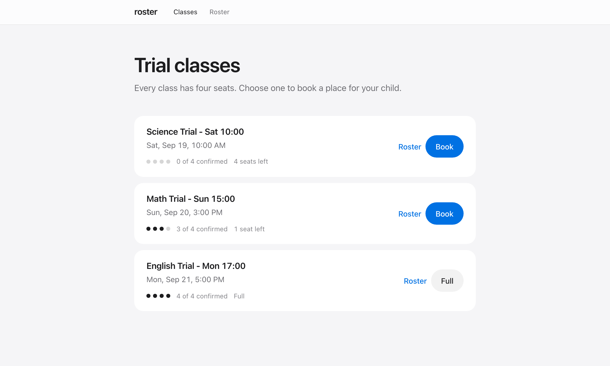

<div align="center">

# roster

**Trial-class booking that stays correct when everyone clicks at once.**

[Live demo](https://roster-web-nine.vercel.app) · [Design notes](docs/DESIGN.md) · [Walkthrough deck](docs/slides.html) · [Deployment](docs/DEPLOYMENT.md)

</div>

<br>



<br>

A parent books a seat for their child in a trial class, pays, and the teacher sees the roster.
Every class has four seats. The interesting part is what happens when several parents go for the
same seat at the same moment — this project exists to get that right, and to prove it.

The whole design is one idea: **a seat is a row, and a row is a mutex.** A class does not have a
capacity number that gets counted; it has four rows in `class_seats`, and a booking claims one.
Overbooking is not checked for. It is impossible to represent.

## What it does

- Lists classes with live seat inventory — confirmed, held, free
- Books a seat for a child and holds it while they pay
- Runs a mock payment that can succeed or decline
- Shows the confirmed roster, in seat order
- Rejects duplicate bookings, overbooking, and payment for a seat that was lost — at the database, not in the UI

## How it stays correct

Three rules, all enforced by Postgres:

| | Rule | Enforced by |
|---|---|---|
| **I1** | A class has exactly `capacity` seat rows | `generate_series` at creation, `UNIQUE (class_id, seat_no)` |
| **I2** | A seat backs at most one confirmed booking | partial unique index on `bookings (seat_id) WHERE status = 'CONFIRMED'` |
| **I3** | One active booking per child per class | partial unique index on `(student_id, class_id) WHERE status IN ('PENDING_PAYMENT', 'CONFIRMED')` |

I1 and I2 together bound confirmed bookings by capacity with no counting anywhere in application code.

Claiming a seat is one statement:

```sql
SELECT id, seat_no FROM class_seats
 WHERE class_id = $1
   AND (status = 'available' OR (status = 'locked' AND pending_until < now()))
 ORDER BY seat_no LIMIT 1
 FOR UPDATE SKIP LOCKED;
```

`SKIP LOCKED` rather than `NOWAIT`: with `ORDER BY … LIMIT 1` every concurrent transaction aims at
the same first free row. `NOWAIT` aborts all but one — four parents booking an empty four-seat class
get one seat and three spurious "class full" errors. `SKIP LOCKED` steps over the held row and takes
the next. Measured, not assumed; the numbers are in [DESIGN.md](docs/DESIGN.md#skip-locked-vs-nowait--measured-not-assumed).

Payment re-checks that the seat is still held by this booking **before** charging, so a parent who
lost the last-seat race is never charged and there is nothing to refund.

The full walkthrough — both transactions step by step, tradeoffs, alternatives considered — is in
[docs/DESIGN.md](docs/DESIGN.md).

## Quick start

Needs **Postgres 14+**, **Bun 1.4+**, **pnpm 11+**, and [k6](https://k6.io) for the load tests.

```sh
git clone https://github.com/muslimalfatih/roster && cd roster
for db in roster roster_test roster_load; do createdb "$db"; done
pnpm install
cp .env.example apps/api/.env
cp .env.example apps/web/.env
pnpm db:reset          # schema + demo data
pnpm dev               # API on :3000, web on http://localhost:5173
```

If your Postgres role is not `postgres` (Homebrew names it after your OS user), edit the DSNs in
`apps/api/.env`. If port 3000 is taken, set `PORT` there and `VITE_API_BASE_URL` in `apps/web/.env`
to match. `.env.example` lists every variable.

```sh
pnpm test              # 20 integration tests over real HTTP
pnpm typecheck
pnpm build
./tests/load/run.sh booking-last-seat    # 20 k6 users, one seat
```

Or with Docker: `docker compose up --build`, then open `http://localhost:3000/api/ready`.

## Try the edge cases

The demo data is set up to show each one. With `pnpm dev` running:

| Case | Do this | What happens |
|---|---|---|
| Happy path | Science Trial → Book → pay | Seat 1, confirmed, on the roster |
| Payment failure | Book a child, **Simulate a decline** | Seat released — count returns to where it was |
| Duplicate | Book the same child into the same class again | 409 `duplicate_booking` from the unique index |
| Full class | English Trial | Button is disabled — and the API rejects it regardless |
| **Last-seat race** | `./tests/load/run.sh booking-last-seat` | 20 parents, one seat: exactly 1 confirmed, 19 rejected at booking, 0 at payment |

Or from the shell against the API — see [DESIGN.md](docs/DESIGN.md#verify-from-the-shell) for the
`curl` sequence.

## Testing

**20 integration tests** drive the real HTTP server against a real Postgres, one test per
invariant or use case. Concurrency tests prime both connection pools first — cold pools serialise
the first burst, which is enough to make a race test pass with the lock removed.

**3 k6 scenarios** — last seat, duplicate, payment failure — with thresholds that fail the run,
so a broken server exits non-zero.

**Mutation tested.** Deleting the row lock fails the race tests and exits k6 with 99. Switching to
`NOWAIT` fails the parallel-fill test. The first versions of both race tests passed with the lock
deleted — the end state looked right, reached through a broken path. That story, and the full
mutation table, is in [DESIGN.md](docs/DESIGN.md#testing-and-verification).

## Stack

| | |
|---|---|
| API | [Elysia](https://elysiajs.com) on Bun, [postgres.js](https://github.com/porsager/postgres) — no ORM |
| Database | Postgres 14+. `schema.sql` is the whole story; no migration tool |
| Web | React 19, TanStack Router + Query, Tailwind 4 |
| Contract | `packages/types` — type-only, shared by both apps |
| Load tests | k6 |

## Deployment

API and Postgres on [Dokploy](https://dokploy.com) from `apps/api/Dockerfile` (build context is the
repo root — it is a pnpm workspace). Web on Vercel from `apps/web`. Two variables have to agree:
`VITE_API_BASE_URL` on the web side and `CORS_ORIGIN` on the API side.
Step by step in [docs/DEPLOYMENT.md](docs/DEPLOYMENT.md).

## Project structure

```
roster/
├─ apps/
│  ├─ api/                      Elysia on Bun
│  │  ├─ db/schema.sql          the three invariants live here
│  │  ├─ db/seed.sql            demo data: a free class, a 3/4 class, a full class
│  │  ├─ src/services/booking.ts   createBooking + completePayment
│  │  ├─ tests/                 integration suite
│  │  └─ Dockerfile
│  └─ web/                      React + TanStack
├─ packages/types/              the API contract
├─ tests/load/                  k6 scenarios + run.sh
└─ docs/
   ├─ DESIGN.md                 the long version
   ├─ REQUIREMENTS.md           use cases and NFRs
   ├─ DEPLOYMENT.md
   └─ slides.html               interactive walkthrough
```

## Roadmap

- **Sweeper for lapsed holds** — release the seat and mark the booking `CANCELLED`, so a parent is told rather than finding out on their next attempt
- **Idempotency keys** on `POST /api/payments/complete`, so retries are safe across restarts
- **Real payment provider** with webhooks — the seat model already supports the async hold: `locked` with `pending_until` *is* the hold
- **Auth** — `studentId` from the session, roster admin-only
- **Waitlist** for parents who lose the race
- **CI** running both suites against a Postgres service container, with the mutation checks as a scheduled job

## License

MIT
